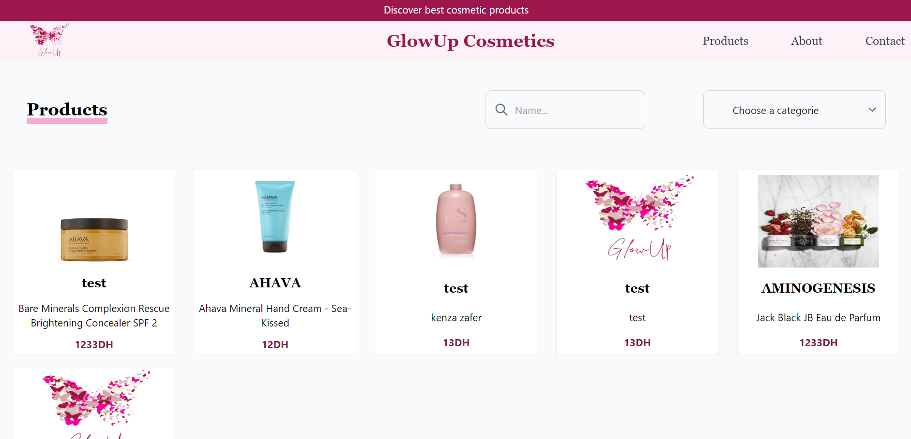

# GlowUp
## Catalogue Web GlowGuru
L'application doit avoir un système d'authentification avec au moins un rôle (Login : Admin), et doit gérer les autorisations de manière que seuls les utilisateurs authentifiés en tant qu'admin puissent accéder à l'espace de travail.

L'admin devra pouvoir gérer les produits cosmétiques (ajouter un nouveau, modifier les informations d'un produit existant, supprimer un produit).

